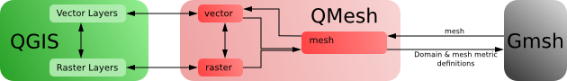

*************
Introduction
*************

Overview
========

QMesh is a software package for creating high-quality meshes using `QGIS <http://www.qgis.org>`_ and `Gmsh <http://geuz.org/gmsh>`_. These meshes can then in turn be used in, for example, finite element-based numerical models such as `TELEMAC <http://www.opentelemac.org/>`_ and `Fluidity <http://www.fluidity-project.org/>`_.

QMesh also has a built-in data management tool based on the `PyRDM library <https://github.com/pyrdm/pyrdm>`_. This allows users to publish (a) their setups and mesh files and (b) the exact version of the QMesh software that they are using, to online repositories hosted by `Figshare <http://www.figshare.com/>`_. In return, a DOI is generated to enable proper citation of research outputs.

Architecture
------------

Given a geometry created in QGIS, the QMesh software creates meshes by interfacing between the QGIS data and the Gmsh mesh generation tool. QGIS data comprises raster and vector layers which are read into QMesh, which then stores them in its own data structures. These data structures, which represent the various shapes and features of the domain, are translated into a format that Gmsh can understand. QMesh then calls on Gmsh to create the mesh for the end-user. This is outlined in the figure below.

QMesh offers both a command-line interface (CLI), and a graphical user interface (GUI) in the form of a plugin for QGIS. More information can be found in the section on `interfaces <interface.html>`_.

License
=======

QMesh is available under the `GNU General Public License <http://www.gnu.org/copyleft/gpl.html>`_. Please see the file ``LICENSE`` for more information.
